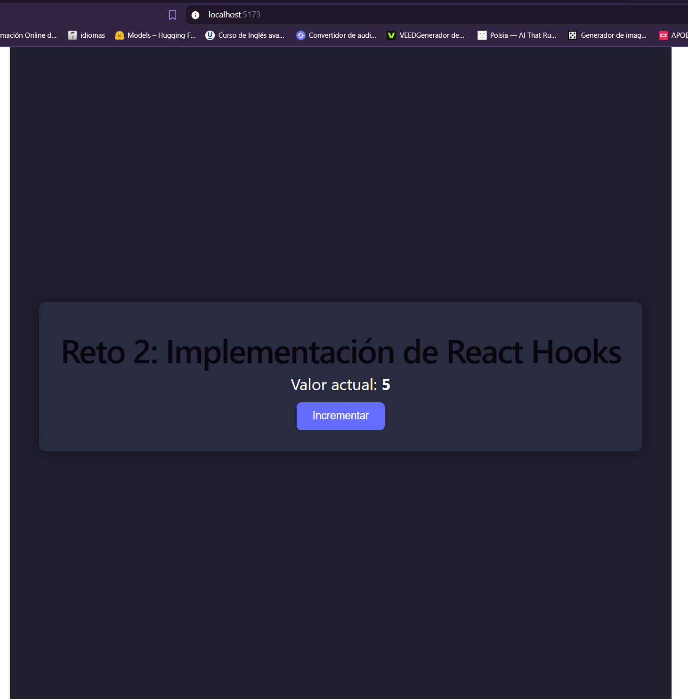
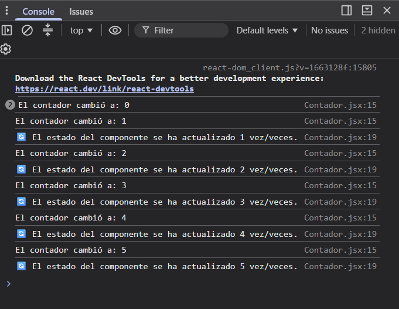
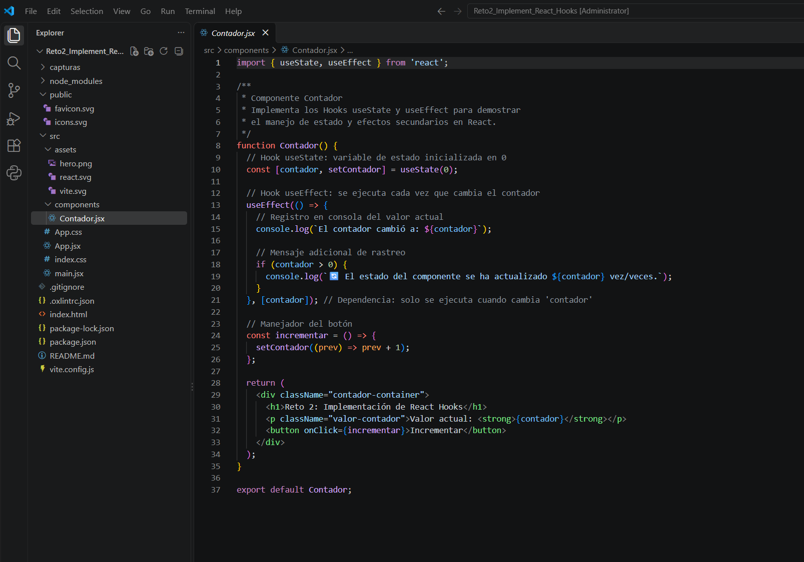
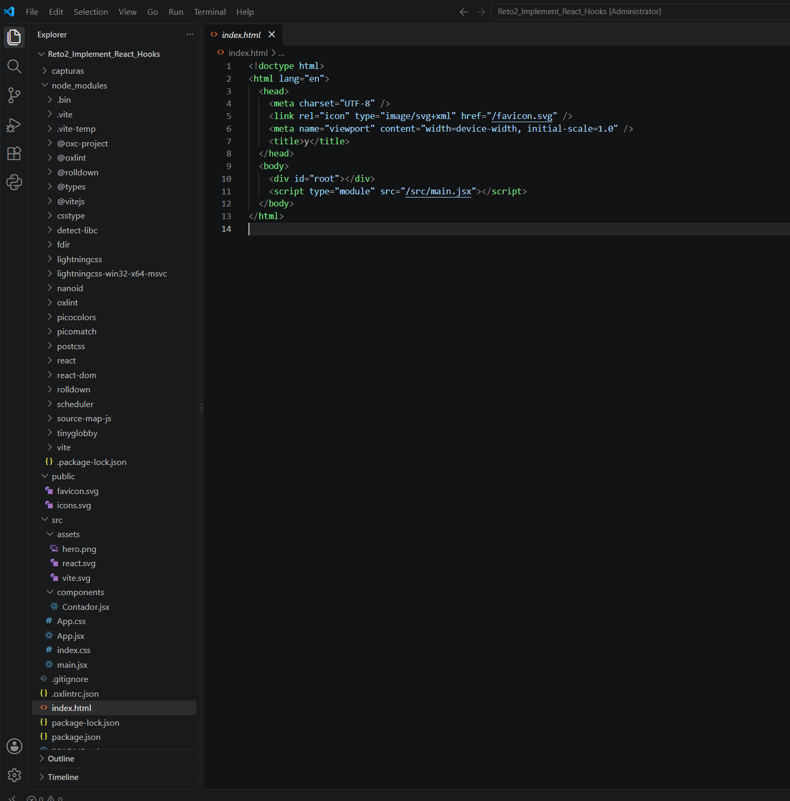
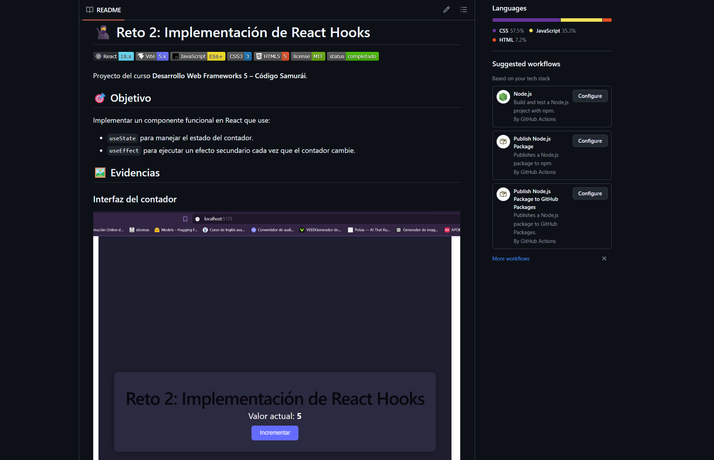

# 🥷 Reto 2: Implementación de React Hooks


Proyecto del curso **Desarrollo Web Frameworks 5 – Código Samurái**.

## 🎯 Objetivo

Implementar un componente funcional en React que use:
- `useState` para manejar el estado del contador.
- `useEffect` para ejecutar un efecto secundario cada vez que el contador cambie.

## 🖼️ Evidencias

### Interfaz del contador


### Registro en consola (useEffect)


### Código del componente


### Estructura del proyecto


### Vista del README en GitHub


## 🚀 Instalación

```bash
git clone https://github.com/TU-USUARIO/Reto2_Implement_React_Hooks.git
cd Reto2_Implement_React_Hooks
npm install
npm run dev
```

Abrir en el navegador: `http://localhost:5173`

## 🧠 Explicación de los Hooks

### `useState`
```jsx
const [contador, setContador] = useState(0);
```
Crea una variable de estado `contador` inicializada en `0` y una función `setContador` para actualizarla.

### `useEffect`
```jsx
useEffect(() => {
  console.log(`El contador cambió a: ${contador}`);
}, [contador]);
```
Se ejecuta **cada vez que `contador` cambia** gracias al array de dependencias `[contador]`. Ideal para logging, peticiones HTTP o suscripciones.

## 📂 Estructura

```
Reto2_Implement_React_Hooks/
├── capturas/
├── public/
├── src/
│   ├── components/
│   │   └── Contador.jsx
│   ├── App.jsx
│   ├── App.css
│   └── main.jsx
├── .gitignore
├── README.md
└── package.json
```

## 🔧 Cómo expandir
- Añadir botones de **decremento** y **reset**.
- Persistir el valor en `localStorage`.
- Migrar a `useReducer` si la lógica crece.

## 👤 Autor

Judit Giravent 
Curso: Desarrollo Web Frameworks 5  
Año: 2026

---

<p align="center">Hecho con ❤️ para <strong>Código Samurái</strong> 🥷</p>